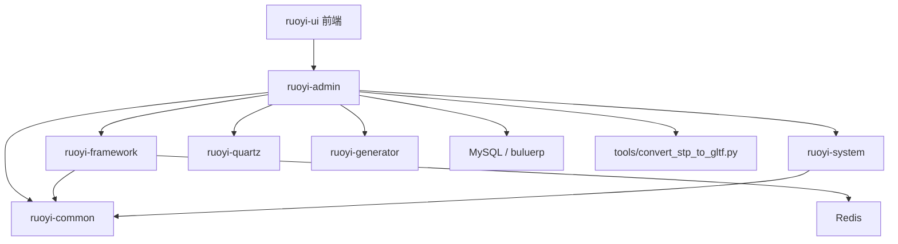
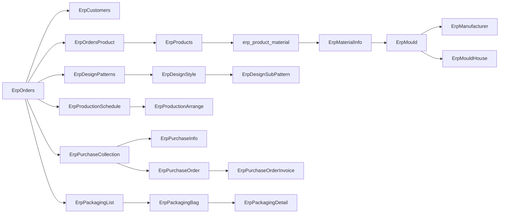
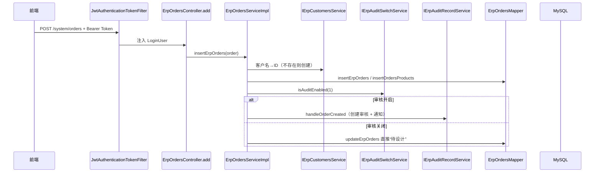

# 蓝宇 ERP 项目逻辑梳理与问题分析

> 生成时间：2026-05-31
> 仓库根目录：`D:\Web\buluerp_backend`
> 分析范围：`buluerp_vue`（若依二开后端 + 前端）、根目录数据库 dump、`tools` 辅助脚本
> 说明：本文是基于源码静态分析的结论，不等同于线上实际运行状态。已有 `项目逻辑详细梳理.md` 与 `SQL与Mapper表覆盖检查.md` 提供细节背景，本文重点在“项目逻辑串联 + 问题定位”。

---

## 一、项目整体定位

- **技术栈**：RuoYi-Vue 3.8.9（Spring Boot 2 + MyBatis/MyBatis-Plus + Spring Security + JWT + Redis + Quartz + Druid）+ Vue2 + Element UI 前端。
- **业务定位**：面向制造/模具/注塑/包装行业的 ERP，主线是“客户 → 订单 → 设计 → 物料/模具 → 布产 → 排产 → 采购 → 包装 → 库存 → 发货”，横向有“审核、通知、操作日志”三条贯穿链路。
- **代码定制位置**：所有 ERP 定制代码都集中在 `ruoyi-admin` 模块的 `com.ruoyi.web` 包下（27 个 Controller、27 个 ServiceImpl、30 个 Mapper、31 个 Domain、45 个 Request DTO），若依其他模块基本未改动。
- **数据库来源**：
  - `buluerp_dump.sql`（根目录）：含完整 `erp_*` 业务表、`sys_*` 若依系统表、`qrtz_*` 定时任务表，共 35+ 张业务表。
  - `buluerp_vue/sql/*.sql`：只有若依基础系统表 + Quartz 表，**不含任何 `erp_*` 业务表**。

---

## 二、目录与模块职责

```
D:\Web\buluerp_backend
├── buluerp_vue/                         # 主工程（多模块 Maven + 前端）
│   ├── ruoyi-admin/                     # Spring Boot 启动；ERP 业务代码全部在此
│   ├── ruoyi-common/                    # 通用工具、注解、异常、常量
│   ├── ruoyi-framework/                 # Spring Security/JWT/Redis/数据源/AOP
│   ├── ruoyi-system/                    # 若依系统管理（用户/角色/菜单/字典）
│   ├── ruoyi-quartz/                    # 若依定时任务
│   ├── ruoyi-generator/                 # 若依代码生成
│   ├── ruoyi-ui/                        # Vue2 + Element UI 前端（仅含若依原生页面）
│   └── sql/                             # 仅含若依系统 + Quartz 初始化脚本
├── output/db-sync/                      # 数据库同步产物目录
├── tools/
│   ├── convert_stp_to_gltf.py           # STP/STEP → GLTF（依赖 cadquery、trimesh）
│   └── requirements.txt
├── buluerp_dump.sql                     # 完整业务库 dump
├── buluerp_dump_err.log                 # mysqldump 警告日志
├── SQL与Mapper表覆盖检查.md             # SQL 缺失分析
├── 项目逻辑详细梳理.md                  # 既有详细梳理
└── 项目逻辑与问题分析.md                # 本文
```

模块依赖关系：



---

## 三、核心业务主线：订单生命周期

`OrderStatus` 枚举（值由 `sys_dict_data` 中 `erp_order_status` 字典动态映射）定义的状态链：

```
审核不通过 → 创建(未审核) → 待设计 → 设计中 → 待定制布产计划
→ 布产计划已定制(待排产) → 排产中 → 生产完成(待采购完成)
→ 已齐料入库(待套料) → 套料中 → 套料完成(待拉线)
→ 拉线组包中 → 拉线完成(待包装) → 包装中 → 已发货 → 已完成
```

状态流转的特点：

1. **字典驱动数值**：状态码不在 Java 枚举里写死，而是通过 `ErpOrdersMapper.getStatusValue/getStatusLabel` 在 `sys_dict_data` 中查询，缺失字典会让流转全部失败。
2. **角色驱动规则**：`OrderStatus.STATUS_RULES` 限制每个状态变更所需角色（如 `design_dept`、`warehouse`、`wirestaying_dept`、`sell_dept`、`admin`）。
3. **审核驱动自动流转**：中间状态注释明确写“不再由部门手动触发，而由布产/采购/包装审核结果自动触发”。审核服务通过 `OperationLog.OPERATOR_SYSTEM` 以 admin 权限自动推进订单。

订单是聚合根，删除时 `deleteErpOrdersByIds()` 会先检查 `productId / productionId / purchaseId / subcontractId` 是否存在下游记录，必须先清理下游业务才能删订单。

订单关联视图：



---

## 四、横向三链路：审核 / 通知 / 操作日志

### 4.1 审核链路（`ErpAuditRecordServiceImpl`）

- 核心表：`erp_audit_record`（审核记录）、`erp_audit_switch`（按业务类型开关）。
- 通用模板：`createAuditRecord(auditType, auditId, preStatus, toStatus)` → `closeFormerAudit` → `mapper.insert`。
- 业务回调：`processAuditByRecordId` 根据 `AuditTypeEnum` 分派到 `handleOrderApproved/Rejected`、`handleProductionScheduleApproved/Rejected`、`handlePurchaseCollectionApproved/Rejected`、`handlePackagingListCompleteApproved/Rejected`，再反向调用对应业务 Service 推进订单/布产/采购/包装状态。
- 审核开关：`IErpAuditSwitchService.isAuditEnabled(type)`；关闭时业务侧直接跳过审核环节，把状态写入终态。

### 4.2 通知链路（`ErpNotificationServiceImpl` + `NotificationAspect`）

- 表：`erp_notification`，按用户/角色/业务 ID 维度发送和已读标记。
- 创建审核记录的同时给目标角色派单。
- `NotificationAspect` 通过 `@MarkNotificationsAsRead` 注解 + SpEL，在业务方法执行后自动把对应业务 ID 的通知置为已读，异常仅记录不阻断主流程。

### 4.3 操作日志链路

- `OperationLogAspect`：拦截 `controller.erp.*Controller.*(..)` 且带 `@ApiOperation` 的方法，方法前后调用 `LogUtil.setUserOperating(true)`、`clearOperationLog()`、`commitOperationLogs()`。
- `OperationLogInterceptor`（MyBatis 插件）：拦截 Mapper 的 INSERT/UPDATE/DELETE，从 SQL 中提取变更前后数据缓存到 ThreadLocal。
- **已确认通过 `ruoyi-admin/src/main/resources/mybatis/mybatis-config.xml` 注册**，`application.yml` 通过 `mybatis-plus.configLocation` 加载该配置，因此拦截器实际生效。

---

## 五、典型接口调用链（以订单新增为例）



