# 蓝宇 ERP 项目逻辑详细梳理

> 生成时间：2026-05-31  
> 工作目录：`D:\Web\buluerp_backend`  
> 分析对象：`buluerp_vue` 若依二开项目、根目录数据库 dump、`tools` 辅助脚本  
> 说明：本文按当前仓库源码梳理，不等同于线上环境运行状态。

## 1. 项目整体定位

本项目是基于 RuoYi-Vue 3.8.9 二次开发的 ERP 系统。若依原生能力仍承担登录、用户、角色、菜单、字典、参数、日志、监控、代码生成、定时任务等基础后台能力；ERP 定制业务主要集中在 `ruoyi-admin/src/main/java/com/ruoyi/web` 包下。

从业务命名和代码链路看，ERP 面向制造/模具/注塑类流程，覆盖客户、订单、产品、设计、物料、模具、厂家、布产、排产、采购、包装、库存、审核、通知、操作日志和 3D 模型转换。

当前仓库有两个数据库来源：

- `buluerp_dump.sql`：根目录完整 dump，包含 `erp_*` 业务表、`sys_*` 若依系统表、`qrtz_*` 定时任务表。
- `buluerp_vue/sql/ry_20240629.sql`、`buluerp_vue/sql/quartz.sql`：若依原生初始化脚本，主要覆盖系统表和 Quartz 表，不覆盖 ERP 业务表。

## 2. 目录与模块职责

```text
D:\Web\buluerp_backend
├── buluerp_vue/                         # 主工程，后端 Maven 多模块 + ruoyi-ui 前端
│   ├── ruoyi-admin/                     # Spring Boot 启动模块；ERP Controller/Service/Mapper/Domain 主要在这里
│   ├── ruoyi-common/                    # 通用工具、基础实体、注解、异常、常量
│   ├── ruoyi-framework/                 # 安全、JWT、Redis、数据源、Web 配置、AOP 等框架能力
│   ├── ruoyi-system/                    # 若依系统管理：用户、角色、菜单、部门、字典、参数
│   ├── ruoyi-quartz/                    # 若依定时任务
│   ├── ruoyi-generator/                 # 若依代码生成
│   ├── ruoyi-ui/                        # Vue2 + Element UI 前端
│   └── sql/                             # 若依系统表和 Quartz 初始化脚本
├── tools/
│   ├── convert_stp_to_gltf.py           # STP/STEP 转 GLTF 的 Python 脚本
│   └── requirements.txt                 # cadquery、trimesh
├── buluerp_dump.sql                     # 当前更完整的业务数据库 dump
└── 项目分析报告.md                       # 已存在的问题分析类文档
```

各后端模块之间的依赖关系大体如下：

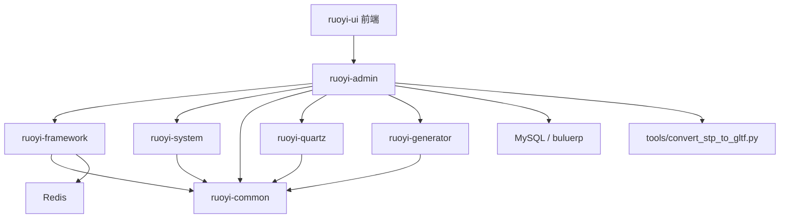

## 3. 后端分层与通用调用链

ERP 定制代码当前规模：

| 分层 | 路径 | 数量 | 作用 |
|---|---:|---:|---|
| Controller | `ruoyi-admin/src/main/java/com/ruoyi/web/controller/erp` | 27 | HTTP 接口入口 |
| Service 接口 | `ruoyi-admin/src/main/java/com/ruoyi/web/service` | 54 | 业务契约，其中含若依/ERP 混合接口 |
| ServiceImpl | `ruoyi-admin/src/main/java/com/ruoyi/web/service/impl` | 27 | ERP 核心业务实现 |
| Mapper 接口 | `ruoyi-admin/src/main/java/com/ruoyi/web/mapper` | 30 | MyBatis/MyBatis-Plus 持久层接口 |
| Mapper XML | `ruoyi-admin/src/main/resources/mapper/web` | 16 | 复杂 SQL、关联查询、自定义增删改查 |
| Domain | `ruoyi-admin/src/main/java/com/ruoyi/web/domain` | 31 | ERP 业务实体 |
| Request | `ruoyi-admin/src/main/java/com/ruoyi/web/request` | 45 | 入参 DTO |
| Aspect/Interceptor | `aspect`、`interceptor` | 3 | 通知已读、操作日志、MyBatis 操作提取 |

典型接口调用链：

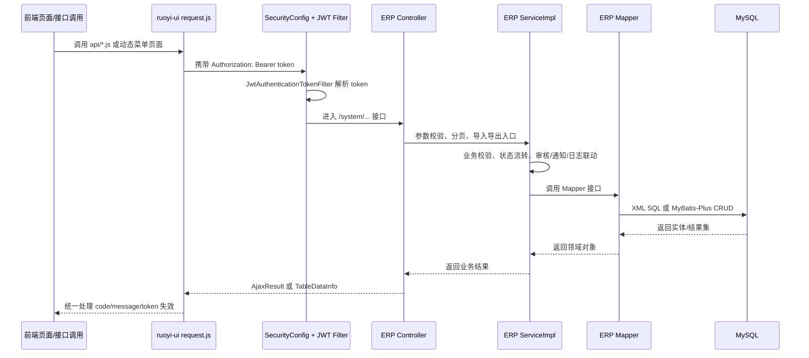

## 4. 登录、权限、菜单和前端路由链路

### 4.1 登录链路

后端入口在 `SysLoginController`：

1. 前端 `ruoyi-ui/src/api/login.js` 调用 `/login`。
2. `SysLoginController.login()` 调用 `SysLoginService.login()`。
3. `SysLoginService` 先校验验证码和登录前置条件，再交给 Spring Security 的 `AuthenticationManager`。
4. 登录成功后 `TokenService` 生成 JWT，并把登录用户信息写入 Redis。
5. 前端 Vuex `user.js` 保存 token。
6. 后续请求由 `request.js` 自动加入 `Authorization: Bearer <token>`。
7. `JwtAuthenticationTokenFilter` 从请求中恢复 `LoginUser`，刷新 token 有效期，并写入 Spring Security 上下文。

### 4.2 菜单和权限链路

前端登录后会继续调用：

- `/getInfo`：返回当前用户、角色集合、菜单权限集合。
- `/getRouters`：由 `ISysMenuService.selectMenuTreeByUserId()` 获取菜单树，再 `buildMenus()` 转换成前端路由结构。

前端 `store/modules/permission.js` 拿到后端菜单后：

1. 把后端返回的 `component` 字符串映射为 `@/views/...` 页面组件。
2. 拼接若依固定路由和后端动态菜单。
3. 写入侧边栏、顶部栏、默认路由。

也就是说，若依系统管理页面主要是“数据库菜单驱动页面”；前端源码本身只保留通用页面，菜单数据决定用户能看到哪些页面。

### 4.3 当前 ERP 前端落地情况

当前 `ruoyi-ui/src/api` 只有 `login`、`menu`、`monitor`、`system`、`tool` 等若依原生 API 封装；`src/views` 也主要是首页、系统管理、监控、工具、登录注册、错误页。未看到与后端 ERP 接口对应的 `orders`、`products`、`purchase`、`inventory`、`audit` 等前端页面和 API 封装。

因此当前代码状态更像是“ERP 后端接口和数据库结构已经大量开发，前端仍以若依原生后台为主”。如果菜单表里配置了 ERP 页面路径，而源码没有对应 Vue 文件，前端动态路由加载会失败。

## 5. ERP Controller 入口板块

ERP 接口统一集中在 `controller/erp`，多数路径挂在 `/system/...` 下：

| 板块 | Controller | 路径 | 主要职责 |
|---|---|---|---|
| 审核记录 | `ErpAuditRecordController` | `/system/audit` | 待审核列表、通用审核、订单/布产/采购/包装审核 |
| 审核开关 | `ErpAuditSwitchController` | `/system/audit-switch` | 控制各类审核是否启用 |
| 客户 | `ErpCustomersController` | `/system/customers` | 客户 CRUD、导入导出 |
| 订单 | `ErpOrdersController` | `/system/orders` | 订单 CRUD、状态字典、统计、订单产品关联 |
| 产品 | `ErpProductsController` | `/system/products` | 产品资料、产品物料关系、设计状态 |
| 设计总表 | `ErpDesignPatternsController` | `/system/patterns` | 订单设计总记录、关联产品 |
| 设计造型 | `ErpDesignStyleController` | `/system/style` | 产品造型、物料引用 |
| 设计子模式 | `ErpDesignSubPatternController` | `/system/pattern` | 设计子项、模具引用 |
| 物料资料 | `ErpMaterialInfoController` | `/system/material-info` | 物料、外购资料、模具资料引用 |
| 物料类型 | `ErpMaterialTypeController` | `/system/material-type` | 物料类型 |
| 模具 | `ErpMouldController` | `/system/mould` | 模具、厂家、库位、物料引用 |
| 模具库 | `ErpMouldHouseController` | `/system/mould-house` | 模具库位 |
| 厂家 | `ErpManufacturerController` | `/system/manufacturer` | 供应/生产厂家 |
| 布产 | `ErpProductionScheduleController` | `/system/products-schedule` | 布产计划、从物料/产品生成、完成标记 |
| 排产 | `ErpProductionArrangeController` | `/system/production-arrange` | 排产安排、从布产计划生成 |
| 采购汇总 | `ErpPurchaseCollectionController` | `/system/purchase-collection` | 采购计划/汇总、从外购资料生成、完成标记 |
| 外购资料 | `ErpPurchaseInfoController` | `/system/purchase-info` | 外购物料资料 |
| 采购订单 | `ErpPurchaseOrderController` | `/system/purchase/order` | 采购订单与发票 |
| 包装清单 | `ErpPackagingListController` | `/system/packaging-list` | 包装/分包清单、Excel 导入导出 |
| 包装袋 | `ErpPackagingBagController` | `/system/packaging-bag` | 包装袋及明细 |
| 包装明细 | `ErpPackagingDetailController` | `/system/packaging-detail` | 分包明细 |
| 产品库存 | `ErpProductInventoryController` | `/system/inventory/product` | 产品库存流水和库存汇总 |
| 胶件库存 | `ErpPartInventoryController` | `/system/inventory/part` | 胶件库存流水和库存汇总 |
| 包材库存 | `ErpPackagingMaterialInventoryController` | `/system/inventory/packaging-material` | 包材库存流水和库存汇总 |
| 通知 | `ErpNotificationController` | `/system/notification` | 用户通知、已读状态 |
| 操作日志 | `ErpOperationLogController` | `system/operation-log` | ERP 业务操作日志查询 |
| 测试部署 | `TestAutoDeployController` | `/erp/test` | 测试/自动部署辅助接口 |

注意：多个 ERP Controller 中存在大量 `@Anonymous`，并且很多 `@PreAuthorize` 被保留但未真正生效或数量不完整。这意味着“方法级权限设计痕迹存在，但当前接口入口大面积绕过登录或授权”。

## 6. 核心业务主线：订单生命周期

订单是整个 ERP 的主轴。`OrderStatus` 枚举定义了业务状态标签：

```text
审核不通过
创建(未审核)
待设计
设计中
待定制布产计划
布产计划已定制(待排产)
排产中
生产完成(待采购完成)
已齐料入库(待套料)
套料中
套料完成(待拉线)
拉线组包中
拉线完成(待包装)
包装中
已发货
已完成
```

订单状态的数值并不是写死在枚举中，而是通过 `sys_dict_data` 中 `erp_order_status` 字典查询：

- `ErpOrdersMapper.getStatusValue(label)`：由字典 label 找 value。
- `ErpOrdersMapper.getStatusLabel(value)`：由 value 找 label。
- `OrderStatus.StatusMapper`：由 `ErpOrdersServiceImpl` 实现。

状态流转由 `OrderStatus.STATUS_RULES` 约束：

- 从 `审核不通过` 到 `待设计` 可以由审核流程处理。
- `待设计` 到 `待定制布产计划` 需要 `design_dept`。
- 部分中间状态注释说明“不再由部门手动触发，而是由布产、采购等关联业务审核结果自动触发”。
- `MATERIAL_IN_INVENTORY` 到 `PACKAGED` 需要 `warehouse`。
- `PACKAGED` 到 `MATERIAL_NESTED` 需要 `wirestaying_dept` 或 `admin`。
- `MATERIAL_NESTED` 到 `COMPLETED` 需要 `sell_dept`。
- 自动流转使用 `OperationLog.OPERATOR_SYSTEM`，会按 admin 权限处理。

订单实体 `ErpOrders` 是多个业务对象的聚合入口：

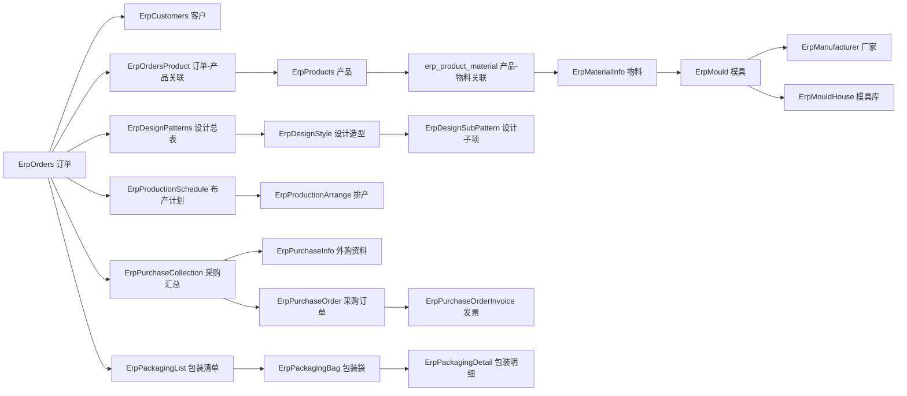

## 7. 订单模块内部调用关系

`ErpOrdersController` 暴露列表、导出、模板、导入、详情、按 innerId 查询、新增、编辑、删除、状态字典、统计等接口。核心业务在 `ErpOrdersServiceImpl`。

### 7.1 新增订单

新增订单的主要逻辑：

1. `ErpOrdersController.add()` 接收订单对象。
2. `ErpOrdersServiceImpl.insertErpOrders()` 设置创建时间、采购/排产完成标记、操作人。
3. 如果传入客户名称但没有客户 ID：
   - 调 `IErpCustomersService.selectErpCustomersByName()` 查客户。
   - 不存在则创建客户。
   - 将客户 ID 回写订单。
4. 校验订单绑定的产品列表、订单产品数量等信息。
5. 调 `ErpOrdersMapper.insertErpOrders()` 写入 `erp_orders`。
6. 如果传入产品列表，写入 `erp_orders_product`。
7. 检查 `IErpAuditSwitchService.isAuditEnabled(1)`。
8. 审核开关打开时，调 `IErpAuditRecordService.handleOrderCreated()` 创建审核记录并发通知。
9. 审核开关关闭时，直接把订单状态设置为待设计。

调用链：

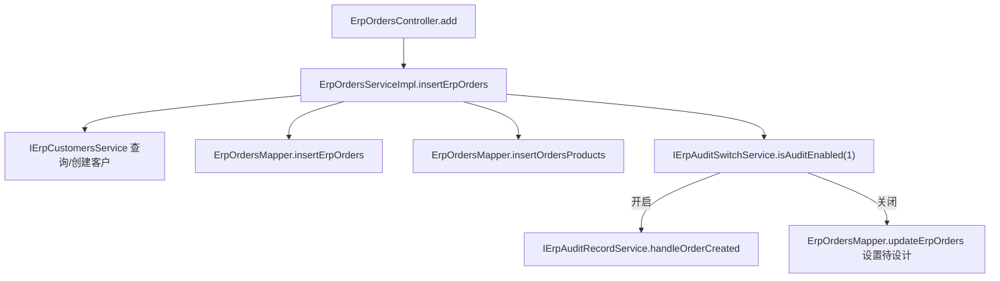

### 7.2 修改订单

修改订单时 `ErpOrdersServiceImpl.updateErpOrders()` 会先查原订单，再融合新旧字段。这里有两个分支：

- 非状态字段变化：直接更新订单基础信息、客户名称、订单产品关联。
- 状态字段变化：先判断审核开关，开启时通过审核记录流转，关闭时直接写状态。

订单状态变更最终会走 `updateOrderStatus()`：

1. 由订单号查旧订单。
2. 通过字典把旧状态和新状态转成 label/value。
3. 读取当前操作人的角色。
4. 用 `OrderStatus.STATUS_RULES` 校验是否允许转换。
5. 写入操作日志缓存。
6. 调 Mapper 更新订单状态。
7. 提交操作日志。

### 7.3 删除订单

删除订单不是简单删除。`deleteErpOrdersByIds()` 会先检查订单是否已经有关联设计、布产、采购、分包等对象：

- 有 `productId`：要求先删除相关设计。
- 有 `productionId`：要求先删除相关布产计划。
- 有 `purchaseId`：要求先删除相关采购计划。
- 有 `subcontractId`：要求先删除相关分包。

这个设计说明订单是聚合根，删除需要先处理下游业务，避免留下孤立数据。

## 8. 设计、产品、物料、模具板块关系

这部分属于生产资料和设计前置链路。

### 8.1 产品板块

`ErpProducts` 保存产品资料，核心字段包括 `innerId`、`outerId`、`designStatus`、`materialIds`。产品和物料通过 `erp_product_material` 建立多对多关系。

典型调用：

```text
ErpProductsController
  -> IErpProductsService
    -> ErpProductsMapper
      -> erp_products
      -> erp_product_material
```

产品又会被订单、设计总表、包装清单引用：

- 订单通过 `erp_orders_product` 引用产品。
- 设计总表 `ErpDesignPatterns.productId` 关联产品。
- 包装清单 `ErpPackagingList.productId` 关联产品。

### 8.2 设计板块

设计板块分三层：

- `ErpDesignPatterns`：设计总表，绑定订单 `orderId` 和产品 `productId`。
- `ErpDesignStyle`：设计造型，绑定产品、分组、物料。
- `ErpDesignSubPattern`：设计子模式，绑定设计总表和模具。

调用关系：

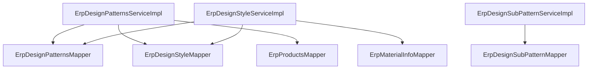

### 8.3 物料和模具板块

物料资料 `ErpMaterialInfo` 与采购资料、模具资料、物料类型关系紧密：

- `ErpMaterialInfoMapper` 查询会关联 `erp_purchase_info`。
- 同时会通过 `mould_number` 关联 `erp_mould`。
- `ErpMouldServiceImpl` 又会调用厂家、物料、模具库服务。

调用关系：

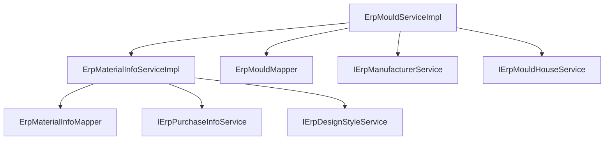

## 9. 布产与排产板块关系

布产计划 `ErpProductionSchedule` 是订单进入生产侧的核心对象，关键字段包括 `orderCode`、`productId`、`materialId`、`arrangeId`、`status`、`auditStatus`。

`ErpProductionScheduleServiceImpl` 依赖很多模块：

- `IErpAuditRecordService`、`IErpAuditSwitchService`：创建/处理布产审核。
- `IErpProductsService`、`ErpProductsMapper`：读产品。
- `IErpOrdersService`：更新订单状态和完成标记。
- `IErpMaterialInfoService`、`IErpMaterialTypeService`：读物料和类型。
- `IErpDesignPatternsService`：从设计生成布产。
- `IErpPurchaseCollectionService`：与采购完成状态联动。
- `IErpProductionArrangeService`：与排产安排联动。
- `ErpProductionScheduleMapper`、`ErpMouldMapper`：持久化和关联查询。

### 9.1 布产生成

布产有多个入口：

- 普通新增：`insertErpProductionSchedule()`。
- 从物料生成：`insertFromMaterial()`。
- 从产品生成：`insertFromProduct()`。

新增后会根据审核开关决定是否调用审核服务；审核通过后，业务会将布产计划标记为通过，并可能自动推进父订单状态。

### 9.2 排产生成

排产 `ErpProductionArrange` 是在布产计划之后的生产安排。

调用链：

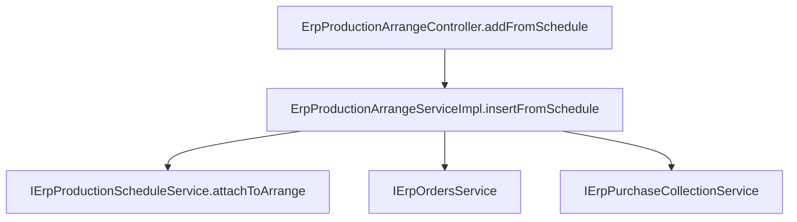

`markArrangeComplete()` 表示排产完成，会进一步影响布产/订单后续状态。

### 9.3 布产完成审核

`ErpProductionScheduleController.markAllDone()` 调用后，不是直接把订单推到下一阶段，而是通过审核服务：

1. 创建布产完成审核记录。
2. 发送通知给布产审核人。
3. 审核通过后 `handleProductionScheduleCompleteApproved()` 会：
   - 找到该订单所有布产记录。
   - 标记布产记录审核通过。
   - 调 `productionScheduleService.executeMarkAllScheduled(orderCode)`。
   - 推进父订单的排产/生产相关状态。

## 10. 采购板块关系

采购链路以 `ErpPurchaseCollection` 为核心，外购资料 `ErpPurchaseInfo` 和采购订单 `ErpPurchaseOrder` 是它的上下游。

### 10.1 外购资料

`ErpPurchaseInfoServiceImpl` 依赖：

- `IErpMaterialInfoService`：外购资料绑定物料。
- `IErpPurchaseCollectionService`：外购资料可生成采购汇总。

### 10.2 采购汇总

`ErpPurchaseCollectionServiceImpl` 依赖：

- `ErpPurchaseCollectionMapper`：读写 `erp_purchase_collection`。
- `IErpOrdersService`：采购完成后推动订单状态或采购完成标记。
- `IErpAuditRecordService`、`IErpAuditSwitchService`：采购审核。
- `IErpPurchaseInfoService`、`IErpMaterialInfoService`、`IErpDesignPatternsService`、`IErpMaterialTypeService`：生成和校验采购明细。

调用链：

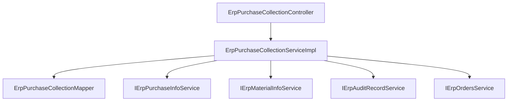

`markAllPurchased()` 和 `tryContinueOrder()` 表示采购完成后会尝试推进订单流程，尤其是“生产完成待采购完成”到“齐料入库待套料”等节点。

### 10.3 采购订单和发票

`ErpPurchaseOrderServiceImpl` 使用 MyBatis-Plus 的 `ServiceImpl<ErpPurchaseOrderMapper, ErpPurchaseOrder>`，并注入：

- `ErpPurchaseOrderMapper`
- `ErpPurchaseOrderInvoiceMapper`

它负责采购订单主体和发票明细的增删改查。

## 11. 包装、分包和库存板块关系

### 11.1 包装清单

`ErpPackagingList` 是包装/分包板块核心对象，字段包括 `orderCode`、`productId`、`bagList`、`status`、`auditStatus`。

`ErpPackagingListServiceImpl` 依赖：

- `ErpPackagingListMapper`
- `IErpOrdersService`
- `IErpProductsService`
- `IErpPackagingBagService`
- `IListValidationService`
- `IErpAuditRecordService`
- `IErpAuditSwitchService`

调用关系：

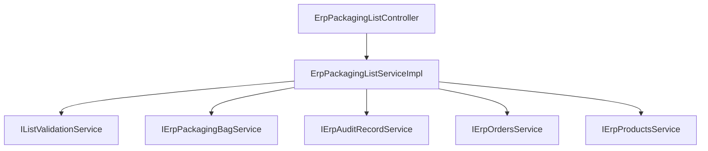

包装清单支持 Excel 模板、导入、导出。导入时会解析包装清单和包装袋/明细，`insertCascade()` 负责级联保存。

### 11.2 分包完成审核

分包完成链路：

1. `ErpPackagingListServiceImpl.markPackagingDone()` 或控制器相关接口触发完成。
2. 若审核开启，则 `ErpAuditRecordService.handlePackagingListCompleteAudit(orderCode)` 创建审核记录。
3. 审核通过时 `handlePackagingListCompleteApproved()`：
   - 按订单号找到所有包装清单。
   - 标记状态和审核状态通过。
   - 调 `packagingListService.executeMarkPackagingDone(orderCode)`。
   - 推进订单到后续包装/发货阶段。

### 11.3 库存

库存分三类：

| 库存类型 | 当前库存表 | 流水表 | Controller |
|---|---|---|---|
| 产品库存 | `erp_product_inventory` | `erp_product_inventory_change` | `ErpProductInventoryController` |
| 胶件库存 | `erp_part_inventory` | `erp_part_inventory_change` | `ErpPartInventoryController` |
| 包材库存 | `erp_packaging_material_inventory` | `erp_packaging_material_inventory_change` | `ErpPackagingMaterialInventoryController` |

库存 Service 基本采用“流水表 + 当前库存表”的双表模式：

1. 新增入库/出库记录到 change 表。
2. 同步更新 inventory 当前库存。
3. 列表接口查流水。
4. `store` 接口查当前库存汇总。
5. 产品库存还会注入 `IErpNotificationService`，用于库存变动提醒。

## 12. 审核、通知、日志三条横向链路

### 12.1 审核链路

审核由 `ErpAuditRecordServiceImpl` 统一承载。核心表：

- `erp_audit_record`：审核记录。
- `erp_audit_switch`：审核开关。

核心枚举：

- `AuditTypeEnum`：审核类型和角色 key。
- `NotificationTypeEnum`：通知类型。

审核创建通用方法：

```text
createAuditRecord(auditType, auditId, preStatus, toStatus)
  -> updateAuditStatus(auditType, auditId, 1)
  -> closeFormerAudit(...)
  -> erpAuditRecordMapper.insert(...)
```

通用审核处理：

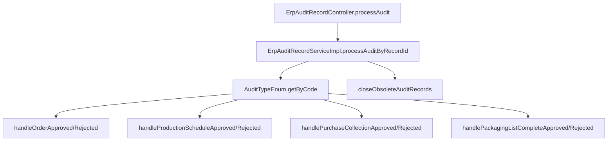

审核通过不是单纯改审核表，而是反调业务 Service：

- 订单审核通过：查订单，设置订单状态为审核记录目标状态，更新订单审核状态。
- 布产审核通过：查订单号下布产记录，标记布产通过，并可能推进订单状态。
- 采购审核通过：查采购汇总，设置状态和审核状态，再尝试推进订单。
- 分包/包装审核通过：查包装清单，设置状态和审核状态，再执行分包完成逻辑。

### 12.2 通知链路

通知表是 `erp_notification`。`ErpNotificationServiceImpl` 负责：

- 按角色发送通知。
- 按业务 ID 和业务类型标记已读。
- 查询用户通知。
- 可能结合 WebSocket 做实时推送。

通知和审核强绑定：

1. 业务创建或状态变更时创建审核记录。
2. 审核服务构造模板数据。
3. `notificationService.sendNotificationToRole(...)` 给指定角色发送通知。
4. 审核处理或业务处理完成后，按业务标记旧通知已读。

此外 `NotificationAspect` 通过 `@MarkNotificationsAsRead` 注解和 SpEL 表达式，在业务方法执行前后自动把相关业务通知标记为已读。该切面失败时只记录日志，不阻断主流程。

### 12.3 操作日志链路

ERP 业务操作日志有两层：

1. `OperationLogAspect`：拦截 `com.ruoyi.web.controller.erp.*Controller.*(..)` 且带 `@ApiOperation` 的接口，设置“当前为用户操作”，方法完成后提交日志。
2. `OperationLogInterceptor`：MyBatis 插件，拦截 Mapper 的 `insert/update/delete`，自动从 SQL 中提取变更前后信息，并把 `OperationLog` 放入 `LogUtil` 的 ThreadLocal 缓存。

调用链：

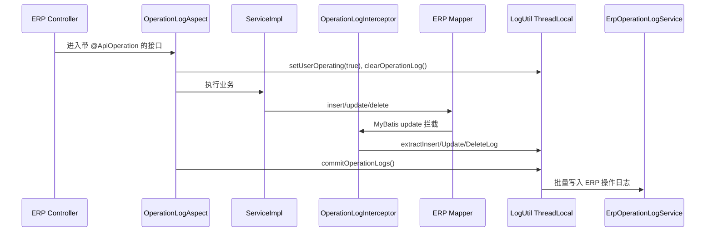

需要注意：当前只从源码搜索到 `OperationLogInterceptor` 类本身，未在配置类中看到显式注册点。如果没有通过 MyBatis 配置自动注册，该自动日志拦截器可能不会生效，需要运行时确认。

## 13. 3D 模型转换链路

3D 转换能力由 Java 工具类和 Python 脚本配合完成：

- Java：`ModelConversionUtils`
- Python：`tools/convert_stp_to_gltf.py`
- 依赖：`cadquery`、`trimesh`

调用逻辑：

1. Java 接收 STP/STEP 文件路径和目标 GLTF 路径。
2. `ModelConversionUtils.resolvePythonPath()` 优先使用 `ruoyi.python-path`。
3. 若配置路径不存在，Windows 回退到 `python`，其他系统回退到 `python3`。
4. `getScriptPath()` 尝试在 `../tools/convert_stp_to_gltf.py` 或 `tools/convert_stp_to_gltf.py` 找脚本。
5. `ProcessBuilder` 启动 Python 脚本。
6. Python 使用 cadquery 导入 STEP，导出临时 STL，再用 trimesh 转 GLTF。
7. Java 等待最多 180 秒，超时强制杀进程。

配置项在 `application.yml`：

```yaml
ruoyi:
  python-path: ../tools/conda/envs/cadquery-env/bin/python
  model-3d-path: /model/3d
```

当前配置路径像 Linux/Conda 环境路径；在 Windows 本地如果该路径不存在，会回退到系统 `python`，所以必须确认本机 Python 环境已安装 `cadquery` 和 `trimesh`。

## 14. 数据库表与代码覆盖关系

根目录 `buluerp_dump.sql` 中可见主要业务表：

```text
erp_audit_record
erp_audit_switch
erp_bom
erp_bom_knowledge
erp_bom_node
erp_customers
erp_design_patterns
erp_design_style
erp_design_sub_pattern
erp_manufacturer
erp_material_info
erp_material_info_model_middle
erp_material_model
erp_material_type
erp_mould
erp_mould_house
erp_notification
erp_operation_log
erp_orders
erp_orders_product
erp_packaging_bag
erp_packaging_detail
erp_packaging_list
erp_packaging_material_inventory
erp_packaging_material_inventory_change
erp_part_inventory
erp_part_inventory_change
erp_product_inventory
erp_product_inventory_change
erp_product_material
erp_production_arrange
erp_production_schedule
erp_products
erp_purchase_collection
erp_purchase_info
erp_purchase_order
erp_purchase_order_invoice
```

代码中已经明显覆盖的表包括订单、客户、产品、设计、物料、模具、厂家、布产、排产、采购、包装、库存、审核、通知、操作日志。

但 dump 中的 `erp_bom`、`erp_bom_knowledge`、`erp_bom_node`、`erp_material_model`、`erp_material_info_model_middle` 当前未看到对应的 Controller/Service/Domain 主链路，疑似是后续功能、历史遗留或未接入模块。后续如果要做 BOM 或模型库功能，需要先确认这些表的业务含义和前端入口。

## 15. 前后端接口衔接关系

当前前端请求统一由 `ruoyi-ui/src/utils/request.js` 处理：

- `baseURL` 来自 `process.env.VUE_APP_BASE_API`。
- 开发环境 `vue.config.js` 代理到 `http://localhost:8080/`。
- GET 参数会被拼接到 URL。
- POST/PUT 会做 1 秒内重复提交检查。
- 响应 code 为 401 时弹出重新登录。
- code 为 500/601/非 200 时统一提示。
- blob/arraybuffer 用于导出下载。

开发环境链路：

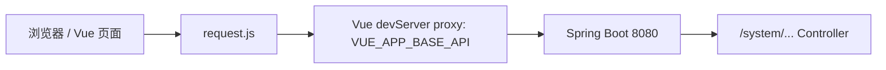

由于当前没有 ERP 前端 API 文件，如果要让 ERP 页面完整可用，需要补齐类似：

```text
src/api/erp/orders.js
src/api/erp/products.js
src/api/erp/design.js
src/api/erp/production.js
src/api/erp/purchase.js
src/api/erp/packaging.js
src/api/erp/inventory.js
src/api/erp/audit.js
src/views/erp/...
```

同时还要在 `sys_menu` 中配置对应菜单、路由组件路径和权限标识。

## 16. 当前关键风险和断点

### 16.1 ERP 接口权限风险

大量 ERP Controller 方法使用 `@Anonymous`。安全配置虽然要求“除 permitAll 外所有请求需要认证”，但 `@Anonymous` 会被若依的 PermitAllUrlProperties 收集并放开。结果是许多订单、采购、库存等核心接口可能无需登录即可访问。

建议：

- 清理 ERP Controller 上的 `@Anonymous`。
- 恢复并统一 `@PreAuthorize("@ss.hasPermi(...)")`。
- 在 `sys_menu` 和权限标识中补齐 ERP 权限。
- 只保留登录、验证码、公开资源等真正匿名接口。

### 16.2 前端 ERP 页面缺失

后端 ERP 接口很多，但前端只有若依原生系统页面。若菜单中配置 ERP 页面路径，源码没有对应组件会导致路由懒加载失败。

建议：

- 先按业务主线补 API 封装。
- 再补列表/详情/审核/导入导出/状态流转页面。
- 菜单表和 Vue 文件路径同步设计。

### 16.3 SQL 初始化来源不一致

`buluerp_vue/sql` 不包含 ERP 表，而根目录 `buluerp_dump.sql` 包含完整业务表。新环境只执行 `buluerp_vue/sql` 会得到一个能跑若依基础系统、但不能跑 ERP 接口的数据库。

建议：

- 把 ERP 建表和种子数据整理成正式 migration。
- 明确“基础若依脚本”和“ERP 业务脚本”的执行顺序。
- 菜单、字典、角色、权限也要包含在 ERP 初始化脚本中。

### 16.4 敏感配置和开放面

当前配置中存在或曾存在以下风险点：

- `token.secret` 默认值为连续字母。
- `application-druid.yml` 包含公网数据库地址和明文密码。
- `application-dev.yml` 包含本地数据库和 Redis 明文密码。
- Druid 控制台用户名/密码为默认值。
- Swagger、Druid、WebSocket、全域 CORS 都比较开放。

建议把数据库、Redis、JWT、Druid 等敏感项移入环境变量或外部配置，并按环境区分开放策略。

### 16.5 自动日志拦截器可能未注册

`OperationLogInterceptor` 代码存在，但当前搜索未看到显式注册点。若未注册，`OperationLogAspect` 只能提交空日志或手动加入的日志，自动 SQL 变更日志不会完整生效。

建议通过运行时 Bean/插件列表、MyBatis 配置或实际操作日志表验证该拦截器是否生效。

### 16.6 3D 转换依赖环境不稳定

Java 配置中的 Python 路径偏 Linux/Conda 风格，本地 Windows 会回退系统 `python`。如果系统 Python 没有安装 cadquery/trimesh，模型转换会失败。

建议：

- 明确 Windows/Linux 各自的 `ruoyi.python-path`。
- 在启动或健康检查中验证脚本和依赖。
- 将转换失败原因返回给业务层，而不是只在日志中体现。

## 17. 建议的阅读和接手顺序

如果后续要继续开发或修复，建议按下面顺序接手：

1. 先读 `ruoyi-admin/src/main/java/com/ruoyi/RuoYiApplication.java`，确认启动入口。
2. 再读 `ruoyi-framework/config/SecurityConfig.java` 和 `JwtAuthenticationTokenFilter.java`，理解鉴权边界。
3. 读 `SysLoginController`、`SysLoginService`、`SysPermissionService`，理解登录、权限、菜单如何进入前端。
4. 读 `ErpOrdersController`、`ErpOrdersServiceImpl`、`ErpOrdersMapper.xml`，把订单聚合根吃透。
5. 读 `OrderStatus.java`，理解订单状态的字典驱动和角色驱动规则。
6. 读 `ErpAuditRecordServiceImpl`，理解审核如何反向驱动订单、布产、采购、包装。
7. 读 `ErpProductionScheduleServiceImpl`、`ErpProductionArrangeServiceImpl`，理解生产侧。
8. 读 `ErpPurchaseCollectionServiceImpl`、`ErpPurchaseInfoServiceImpl`、`ErpPurchaseOrderServiceImpl`，理解采购侧。
9. 读 `ErpPackagingListServiceImpl` 和三个库存 Service，理解出货/库存侧。
10. 最后读 `ruoyi-ui/src/utils/request.js`、`store/modules/permission.js`、`router/index.js`，确认前端接入缺口。

## 18. 一句话总结

这个项目的后端已经形成了以订单为中心、审核通知为横向驱动、布产/采购/包装/库存为下游业务链的 ERP 雏形；若依基础系统负责登录权限和菜单框架。但当前交付断点也很清楚：ERP 前端页面缺口较大，业务 SQL 初始化不在标准 `sql` 目录内，核心 ERP 接口存在大面积匿名访问风险，配置和 3D 转换环境需要按真实部署环境重新收敛。
